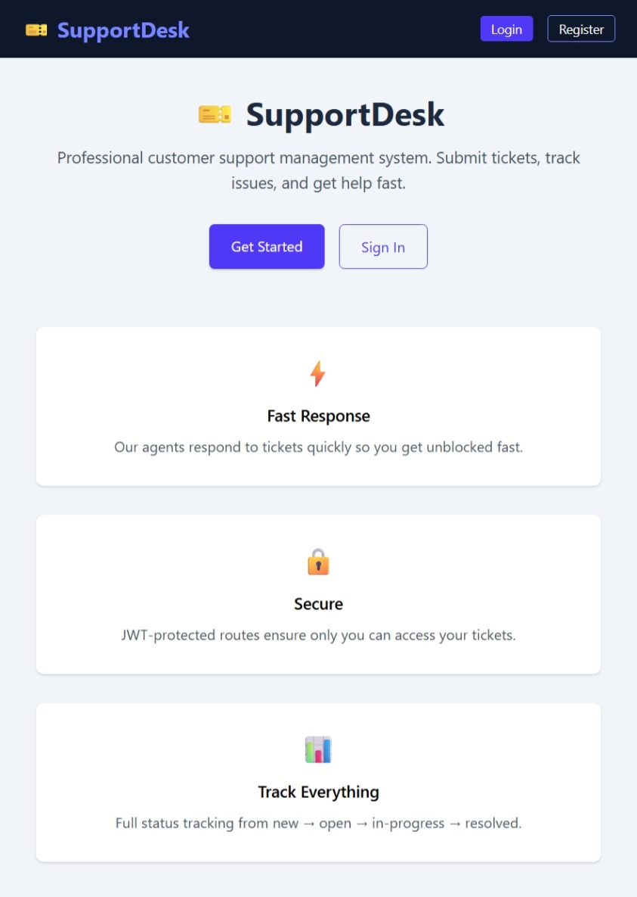
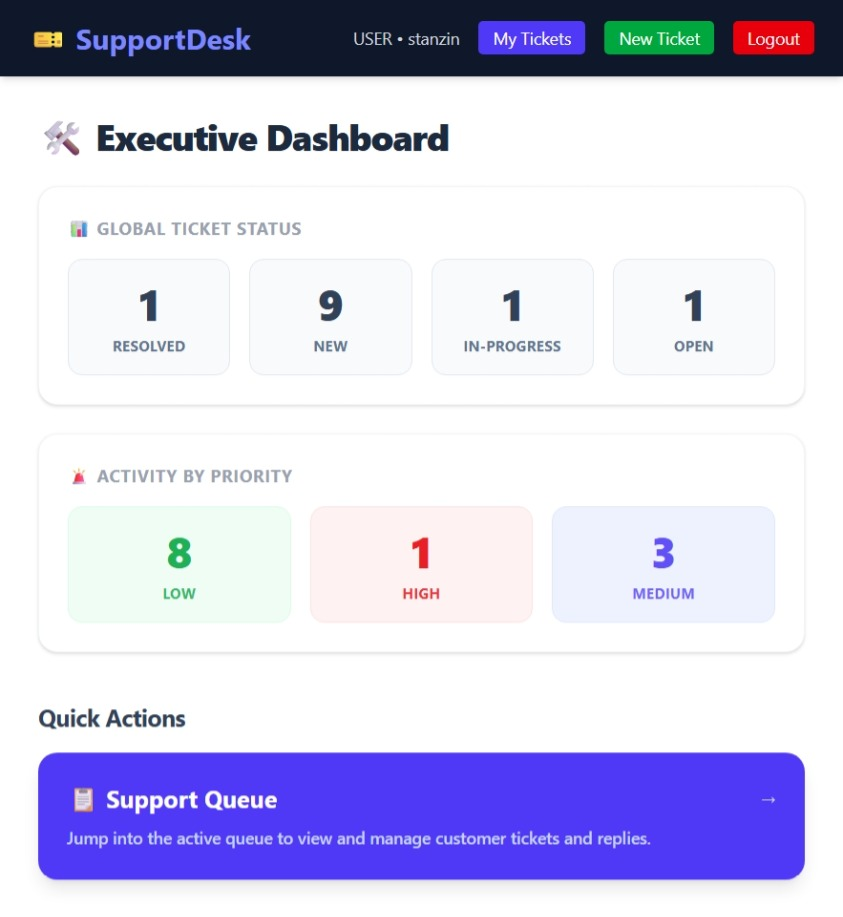
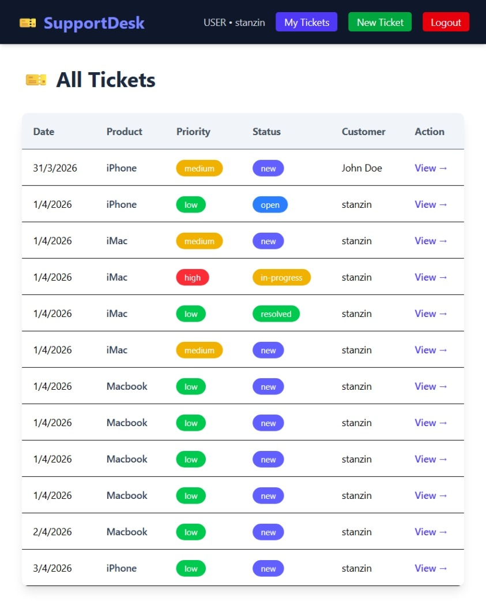
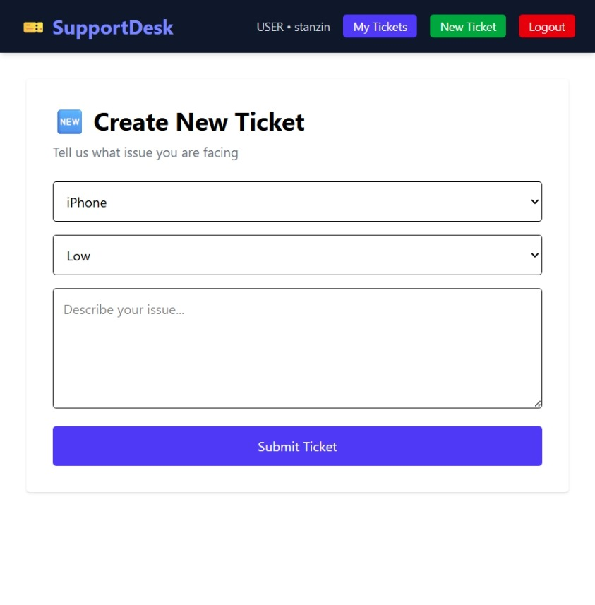
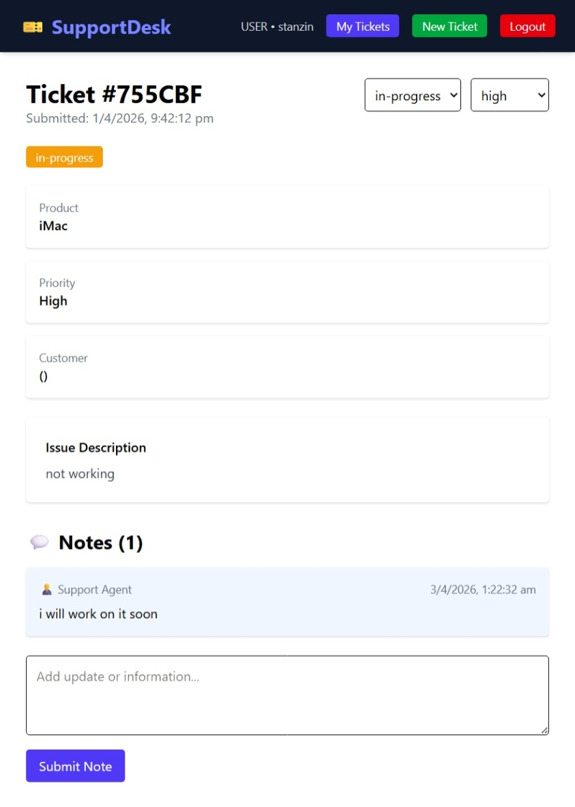
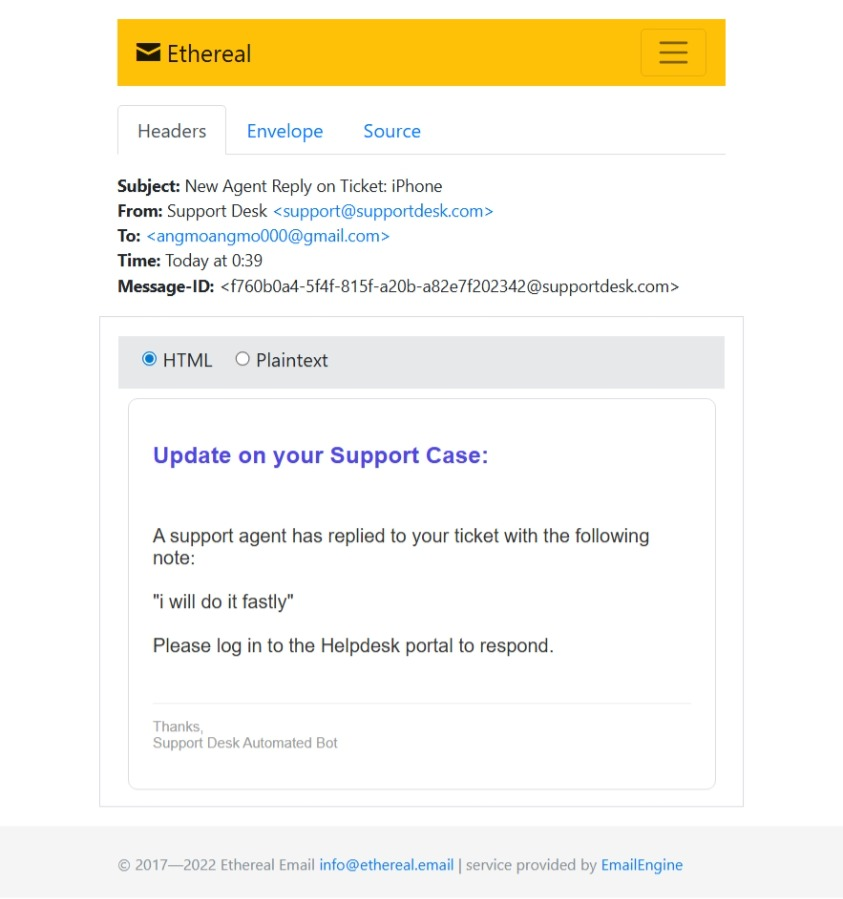
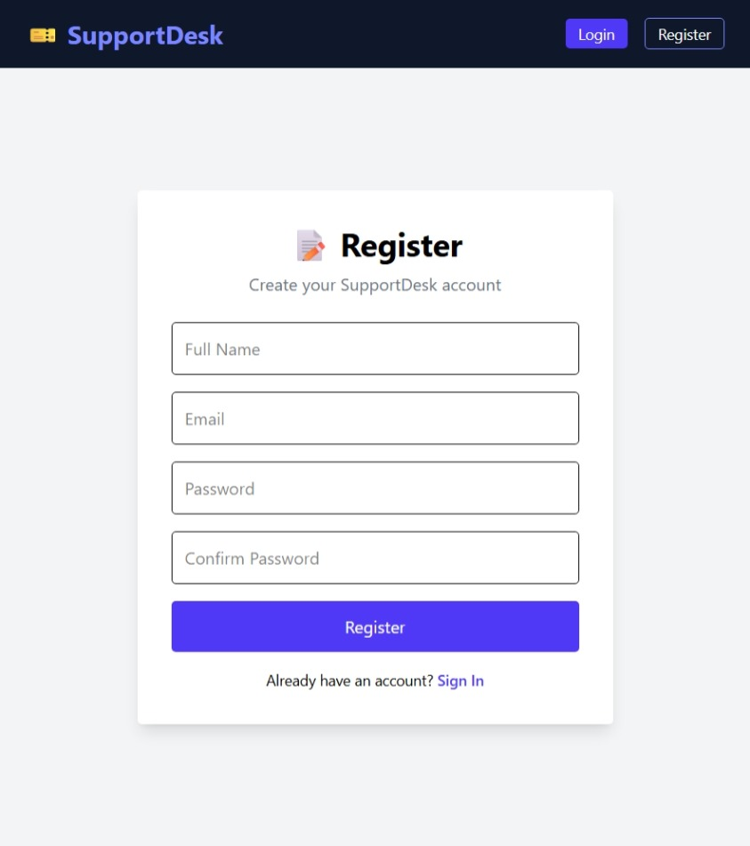

# 🎫 Support Desk - Enterprise Ticketing System


An enterprise-grade, full-stack Helpdesk Support ticketing system built to streamline IT operations. Features role-based authentication, real-time agent-customer live messaging via WebSockets, and a robust administrative MongoDB aggregation dashboard.


## ✨ Features
- **Secure Authentication (JWT)**: Route protection and distinct User, Agent, and Admin methodologies.
- **Redux State Management**: Centralized application state tracking asynchronous API thunks resulting in a seamless, instant-loading UX.
- **Live Bidirectional Chat**: Uses Socket.io to broadcast component updates and agent notes securely in real-time.
- **Data Aggregation Dashboard**: A sleek Tailwind CSS GUI that dynamically aggregates MongoDB `$group` metrics to present executive summaries of priority and status distributions.
- **Automated Email Notifications**: Employs Nodemailer to instantly construct and emit HTML status updates to users when their tickets are touched by Staff.

## 🛠️ Infrastructure
- **Frontend Architecture**: React.js, Redux Toolkit, Tailwind CSS, Vite, Axios
- **Backend Architecture**: Node.js, Express.js, Socket.io, Nodemailer
- **Database Architecture**: MongoDB (Atlas), Mongoose ORM

## 🚀 Getting Started

### 1. Prerequisites
Ensure you have Node.js and MongoDB installed perfectly. Define the following in `backend/.env` (do not commit this file!):
```env
PORT=5000
MONGO_URI=your_mongodb_cluster_string
JWT_SECRET=your_jwt_strong_secret
```

### 2. Installation
Install dependencies concurrently for both modules:
```bash
# Install backend dependencies
cd backend
npm install

# Install frontend dependencies
cd ../frontend
npm install
```

### 3. Execution (Development)
You will need two terminal windows actively running.

**Terminal 1 (Backend):**
```bash
cd backend
npm run dev
```

**Terminal 2 (Frontend):**
```bash
cd frontend
npm run dev
```

## 🔒 Security Posture
- Passwords mathematically hashed via `bcryptjs`.
- Restricted API access gated comprehensively via deeply integrated custom Middleware guards.
- Protected frontend routing to avert unauthorized UI components rendering.

## 📸 Application Screenshots

<p align="center">
  
  &nbsp;
  
  &nbsp;
  
</p>

<p align="center">
  
  &nbsp;
  
  &nbsp;
  
</p>

<p align="center">
  
</p>
